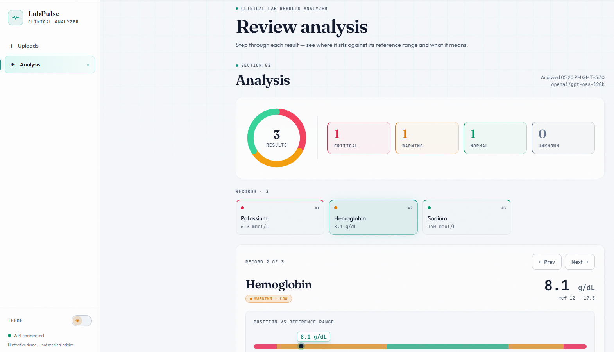
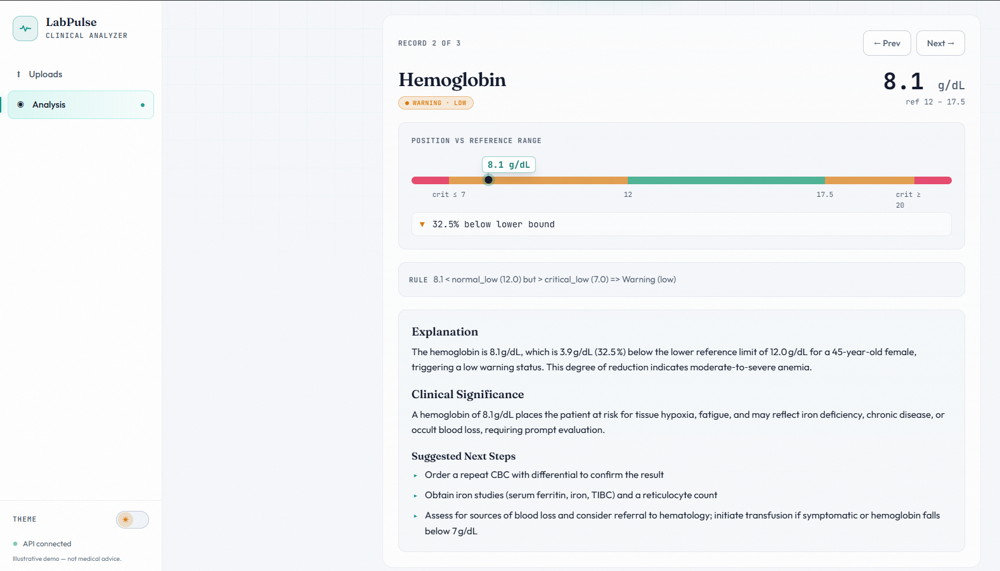
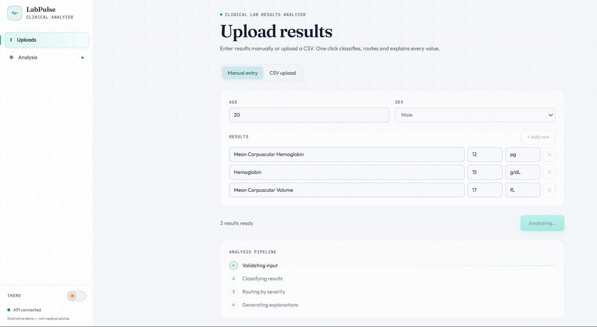
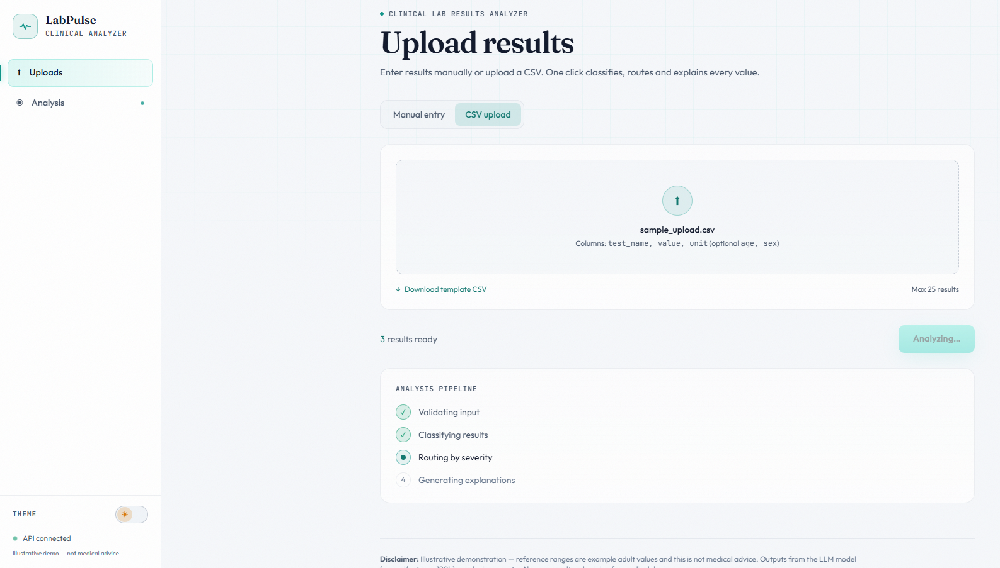
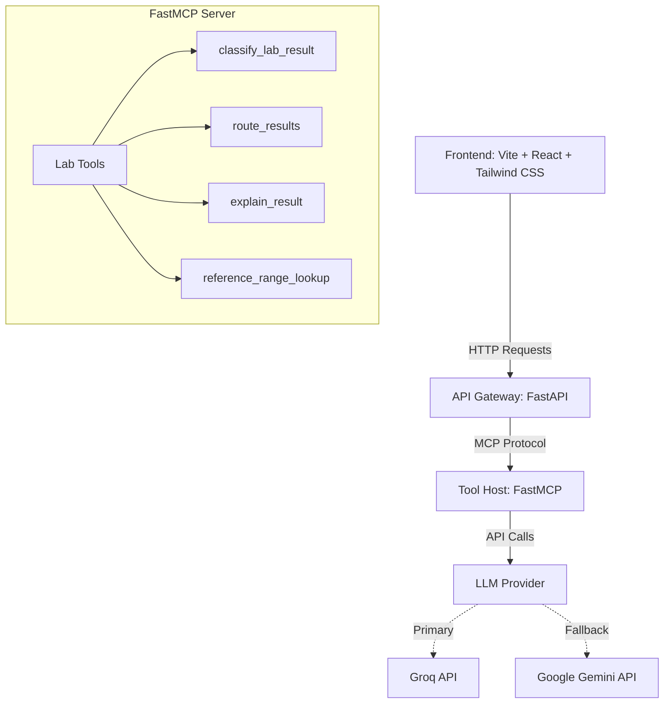

# LABPULSE-Aragen Life Science hackathon

## Description

This is a **Clinical Lab Results Analyzer**, developed as a hackathon project for **Aragen Life Sciences**.
It is a full-stack web service that accepts lab results, classifies each as Normal, Warning, or Critical, routes them by severity, and produces an explainable, contextual result using AI.

## Working

Here are some screenshots demonstrating the functionality of the application:

### 1. Analysis Dashboard


*The main dashboard where users can view the analysis of their lab results, categorized by severity.*

### 2. Test Analysis Details


*Detailed view of an individual lab test result, including the AI-generated clinical explanation and next steps.*

### 3. Multiple Manual Entry


*The interface for manually entering multiple lab results at once.*

### 4. CSV Upload


*The interface for uploading lab results in bulk using a CSV file.*

## Quick Start

### 1. Backend Setup

```bash
cd backend
python -m venv venv
# Windows: venv\Scripts\activate
# Unix: source venv/bin/activate
pip install -r requirements.txt
cp .env.example .env
# Edit .env and add your GROQ_API_KEY (and optionally GEMINI_API_KEY as fallback)
```

### 2. Frontend Setup

```bash
cd frontend
npm install
```

### 3. Running Locally

Run the backend processes (MCP Server and API Gateway):

```bash
# Using powershell helper script
.\run_dev.ps1
# Or run manually in separate terminals:
# Terminal 1: python -m backend.mcp_server.server
# Terminal 2: uvicorn backend.api.main:app --port 8000
```

Run the frontend dev server in a new terminal:

```bash
cd frontend
npm run dev
```

The app will be available at http://localhost:5173.

## Project Architecture Diagram



## File Structure

```
Clinic_mcp_aragen/
├── backend/                  # Backend API and MCP server
│   ├── api/                  # FastAPI Gateway
│   ├── mcp_server/           # FastMCP server and tools
│   ├── requirements.txt      # Python dependencies
│   └── .env.example          # Environment variables template
├── frontend/                 # Frontend React Application
│   ├── src/                  # Source code (Components, API client, etc.)
│   ├── public/               # Static assets (including CSV template)
│   ├── package.json          # Node dependencies
│   └── vite.config.js        # Vite configuration
├── assets/                   # Screenshots for documentation
├── test_data/                # Sample CSV data for testing
├── README.md                 # Project documentation
├── ARCHITECTURE.md           # Detailed architecture documentation
├── UI_UX.md                  # UI/UX design documentation
└── PRD.md                    # Product Requirements Document
```
