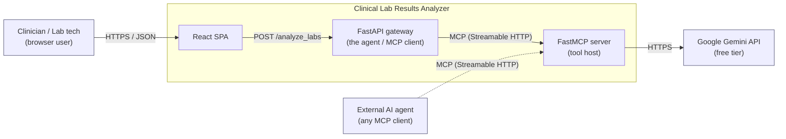
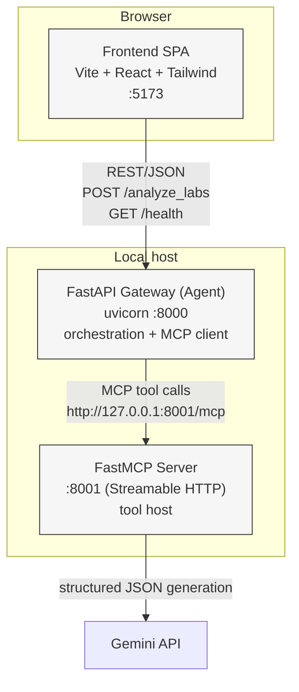
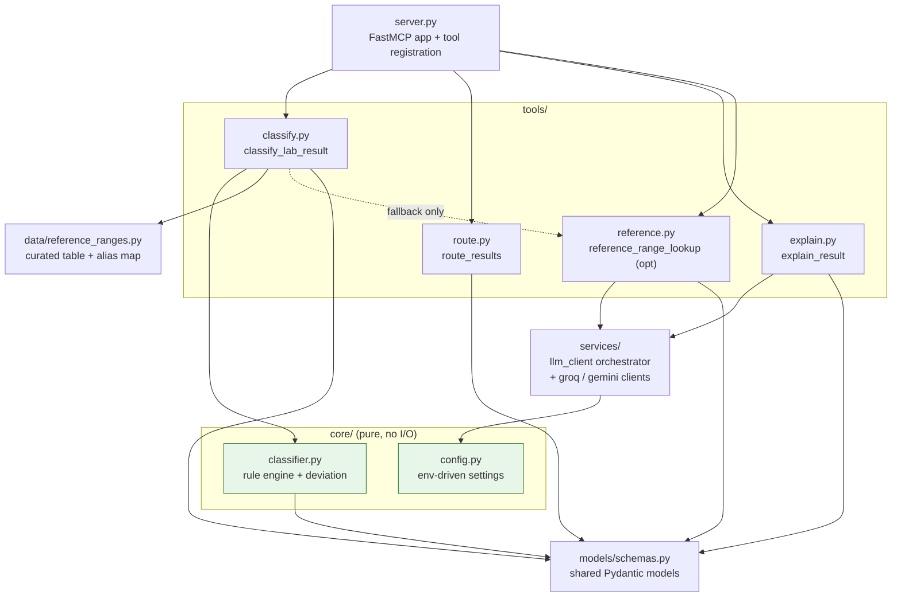
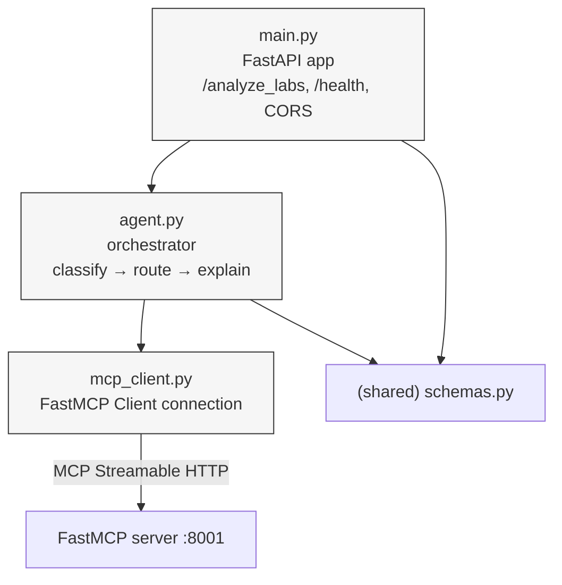
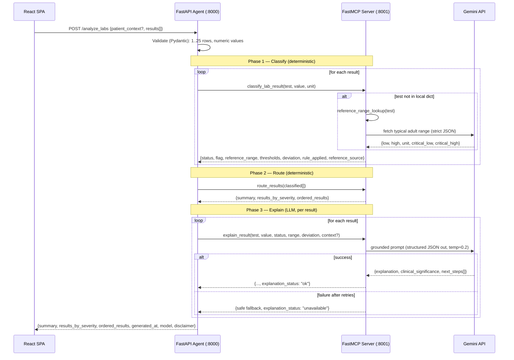
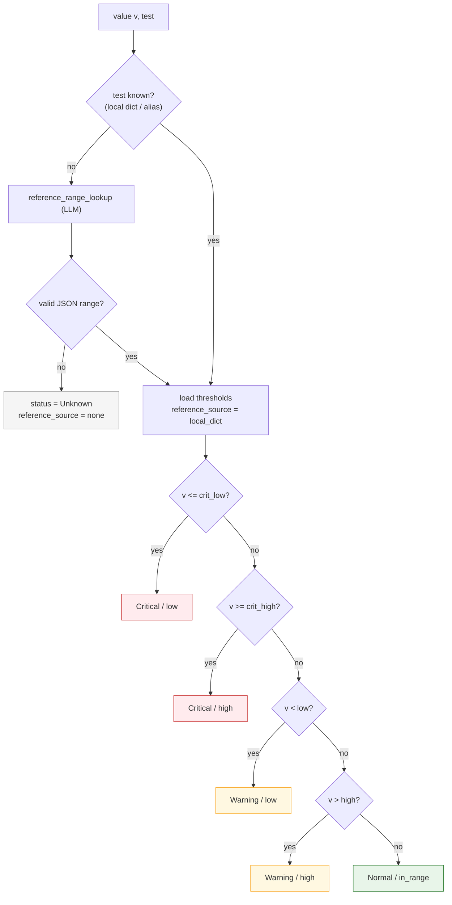
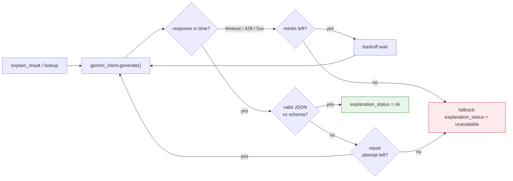

# Architecture — Clinical Lab Results Analyzer

**Version:** 1.0
**Status:** Draft (companion to [PRD.md](./PRD.md) v1.0)
**Owner:** hp
**Last updated:** 2026-09-02
**Audience:** engineers building and reviewing the service; graders assessing the assignment.

> ⚠️ **Clinical safety note.** This is a technical demonstration. Reference ranges are illustrative adult values; outputs are **not medical advice**. See PRD §0.3.

---

## 1. Purpose & scope

This document describes *how* the Clinical Lab Results Analyzer is built. The [PRD](./PRD.md) defines *what* it does and *why*; this file is the engineering counterpart — the structural views, runtime behavior, integration contracts, cross-cutting concerns, and the decision records that justify the shape of the system.

Where the PRD and this document overlap, the PRD is the source of truth for product requirements and this document is the source of truth for technical structure. Nothing here contradicts the PRD; it elaborates it.

In scope: component structure, runtime flows, MCP and LLM integration, the classification engine, data model, resilience, configuration, observability, security/safety, and extensibility.

Out of scope (per PRD §11): authentication, persistence/database, deployment/hosting, real EHR/LIS integration, and UI CSV upload.

---

## 2. Architectural drivers

The design is shaped by five forces, in priority order. Every significant decision in §12 traces back to one of these.

1. **Explainability is the product.** For every result the user must see *what* (status), *why* (the numeric rule + reference range), and *what it means / what to do* (LLM explanation + next steps). This forces a **deterministic, inspectable classification path** separate from the probabilistic LLM.
2. **Safety through determinism.** Classification is rule-based and authoritative. The LLM may *describe* a status but must never *decide or change* it. This bounds the blast radius of a hallucination.
3. **Graceful degradation.** The rubric requires "end-to-end works without crashes." The system must return a valid, useful response even when the LLM is unavailable or a test is unknown.
4. **MCP-first integration.** The assignment requires that the MCP server be built and used for *all* tool communication by the agent. The FastAPI gateway is therefore a pure MCP *client*; it holds no tool logic of its own.
5. **Modularity & testability.** Pure logic is isolated from I/O so the rules can be unit-tested exhaustively and the transport layers stay thin.

### 2.1 Quality attributes and how they are met

| Attribute | How the architecture delivers it |
|-----------|----------------------------------|
| Explainability | Deterministic classifier emits the exact `rule_applied`, `reference_range`, and `deviation`; the LLM is grounded in those numbers. |
| Reliability | Classification never depends on the network; LLM calls are retried with backoff and fall back to `explanation_status: "unavailable"`. |
| Testability | `core/classifier.py` is pure (no I/O), so boundary cases are unit-testable; tools mock the Gemini and MCP boundaries. |
| Modularity | One tool per module; shared Pydantic schemas; transport is a thin shell over logic. |
| Configurability | All tunables (model, ports, timeouts, caps) live in `.env`; thresholds live in one data file. |
| Safety | Deterministic status is authoritative; LLM instructed never to reclassify; disclaimer surfaced in UI, API, and README. |

---

## 3. System context (C4 — Level 1)

The service sits between a human operator (or any MCP-capable AI agent) and Google's Gemini API. It is self-contained: no database, no auth provider, no third-party services beyond the LLM.



Two classes of consumer exist. The **primary** path is a human using the React SPA through the FastAPI gateway. The **secondary** path (dashed) is any external MCP client connecting directly to the FastMCP server to reuse the tools — this is the "reusable across applications" end goal, and it is available for free because all tool logic lives behind MCP.

---

## 4. Container view (C4 — Level 2)

Three processes, three ports. Each is independently startable; a convenience script starts the two backend processes together.



| Container | Tech | Port | Responsibility | Talks to |
|-----------|------|------|----------------|----------|
| Frontend SPA | Vite + React + Tailwind | 5173 (dev) | Manual-entry form, results rendering, severity/explainability UI | FastAPI gateway (REST) |
| FastAPI Gateway ("the agent") | FastAPI + uvicorn + FastMCP **client** | 8000 | Request validation, orchestration (Classify→Route→Explain), aggregation, health | FastMCP server (MCP) |
| FastMCP Server | FastMCP | 8001 | Hosts the 3 core tools + 1 optional tool; owns all tool logic | Gemini API |

### 4.1 Process / port map

| Process | Port | Indicative command |
|---------|------|--------------------|
| FastMCP server | 8001 | `python -m backend.mcp_server.server` |
| FastAPI gateway | 8000 | `uvicorn backend.api.main:app --port 8000` |
| Frontend dev server | 5173 | `npm run dev` |

`run_dev.sh` starts the MCP server, waits for it to become reachable, then starts the API; the frontend is started separately with `npm run dev`. Startup order matters only in that the API's `/health` will report `mcp_server: "unreachable"` until the MCP process is listening — it does not crash.

### 4.2 Why the split (agent vs. tool host)

The FastAPI gateway is the **agent**: it owns the *sequence* (classify → route → explain), retries, and aggregation, and it is the *sole* MCP client. The FastMCP server is the **tool host**: it owns the *capabilities* and knows nothing about orchestration. Keeping these in separate processes makes the client/server boundary literal — every tool invocation crosses a real MCP transport — which is exactly what the assignment asks to demonstrate, and it is what lets an external agent reuse the tools without touching the gateway.

---

## 5. Component view (C4 — Level 3)

### 5.1 FastMCP server internals



The dependency rule is one-directional: **tools depend on core + services; core depends on nothing but schemas.** `classifier.py` performs zero I/O, which is what makes the boundary-case suite in PRD §5.2 fast and exhaustive. Services (`gemini_client.py`) hide all network concerns behind a typed interface, so tools never touch HTTP or retry logic directly.

| Module | Kind | I/O? | Notes |
|--------|------|------|-------|
| `core/classifier.py` | Pure logic | No | Applies the §7 rules, computes deviation metrics. Fully unit-tested. |
| `core/config.py` | Config | Reads env | Central settings; no magic numbers elsewhere. |
| `data/reference_ranges.py` | Data | No | The 8-test curated table + alias normalization map. Single source of range truth. |
| `services/gemini_client.py` | Service | Network | Gemini (fallback): API-key load, timeout, exponential backoff, JSON parse/repair, structured logging. |
| `services/groq_client.py` | Service | Network | Groq (primary, OpenAI-compatible): same resilience guarantees via `httpx`. |
| `services/llm_client.py` | Orchestrator | — | Tries Groq first, then Gemini; returns which provider/model served the call. |
| `models/schemas.py` | Contract | No | Pydantic models shared across server and gateway; no untyped dicts cross boundaries. |
| `tools/*.py` | Adapters | Mixed | Thin: validate input → call core/service → return typed output. One tool per file. |

### 5.2 FastAPI gateway internals



`main.py` is the HTTP shell (routing, CORS, request/response models). `agent.py` is the orchestration brain: it drives the Classify→Route→Explain sequence, applies the per-result retry/degradation policy, and merges classify + explain outputs into the enriched result objects. `mcp_client.py` owns the single MCP connection and exposes a typed `call_tool` surface so the orchestrator never sees transport details.

---

## 6. Runtime view — the agent flow

The orchestration is a fixed three-phase pipeline. Classification and routing are deterministic and offline; only explanation touches the network.



Three properties of this flow are load-bearing:

The **classify phase is authoritative and offline** (except for the rare unknown-test lookup). Even if every subsequent Gemini call fails, the response already contains correct statuses and ordering. The **route phase is a pure sort + count** over classify outputs, so it can never fail on data that classified successfully. The **explain phase is per-result and independently degradable** — one result's LLM failure produces a fallback for that card only; it does not abort the request or affect any other result.

### 6.1 Enriched result object

Each item in `ordered_results` is the merge of a classify output and an explain output:

```
classify(test, value, unit)        explain(..., status, range, deviation)
        │                                       │
        ├─ status, flag                         ├─ explanation
        ├─ reference_range, thresholds          ├─ clinical_significance
        ├─ deviation {direction, distance, %}   ├─ next_steps[]
        ├─ rule_applied (human-readable)        └─ explanation_status (ok|unavailable)
        ├─ reference_source (local|llm|none)
        └─ unit_mismatch
                        └──────── merged by agent.py ────────┘
```

This single shape is what the frontend renders — the "what" (status/flag), the "why" (range/thresholds/deviation/rule_applied/source), and the "meaning" (explanation/next_steps) all travel together.

---

## 7. Classification engine

The engine lives in `core/classifier.py` as pure functions over `(value, thresholds)`. The rules are inclusive and unambiguous (PRD §5.2):

```
Given value v and bounds (crit_low, low, high, crit_high):
  1. crit_low  is not None and v <= crit_low   -> Critical, flag=low
  2. crit_high is not None and v >= crit_high  -> Critical, flag=high
  3. v < low                                    -> Warning,  flag=low
  4. v > high                                   -> Warning,  flag=high
  5. otherwise                                  -> Normal,   flag=in_range
```

Boundary semantics are fixed: a value exactly at `low`/`high` is **Normal**; a value exactly at `critical_low`/`critical_high` is **Critical**; an unknown test whose lookup fails is **Unknown** (never a crash). Deviation metrics — `distance_from_bound` and `percent_from_bound` — are computed for out-of-range values and passed downstream so the explanation is grounded in the *magnitude* of abnormality, not just its direction.



### 7.1 Reference data & normalization

`data/reference_ranges.py` holds the 8 curated adult tests (Hemoglobin, WBC, Platelets, Glucose (fasting), Creatinine, Sodium, Potassium, Calcium) with their normal and critical bounds, plus an **alias map** (`Hgb → Hemoglobin`, `K → Potassium`, `Na → Sodium`, `WBC count → WBC`, …) so common variants resolve to a canonical test. Because thresholds and aliases live in exactly one file, adding a test or synonym is a one-line data edit with no logic change — this is the extensibility path promised in PRD §A3.

---

## 8. Integration architecture

### 8.1 MCP (client ↔ server)

Transport is **Streamable HTTP**. The gateway connects to `http://127.0.0.1:8001/mcp` via a FastMCP `Client` held in `mcp_client.py`. All four tools are invoked over this transport — the gateway contains no tool logic, satisfying the "MCP is used for all communication" requirement. Because the tools are registered on a standalone FastMCP server, any third-party MCP client can discover and call them with no gateway involvement.

Tool contracts (full I/O schemas in PRD §4):

| Tool | Deterministic? | LLM? | Role |
|------|:---:|:---:|------|
| `classify_lab_result` | ✅ | ❌ | Value → status/flag/range/deviation/rule. Calls lookup only for unknown tests. |
| `route_results` | ✅ | ❌ | Sort + group + count by severity (order: Critical → Warning → Normal → Unknown; stable within a group). |
| `explain_result` | ❌ | ✅ | Grounded natural-language explanation + next steps (once per result). |
| `reference_range_lookup` (opt) | ❌ | ✅ | Fallback range for tests absent from the curated table; result flagged `llm_lookup`. |

### 8.2 LLM (Groq → Gemini fallback)

All LLM access is funneled through a single client layer. The **primary** provider is **Groq** (OpenAI-compatible, `GROQ_MODEL` default `openai/gpt-oss-120b`); **Google Gemini** (`GEMINI_MODEL`) is the **fallback** used only when Groq is unavailable or fails. Both clients load their keys from env, enforce a timeout, retry with exponential backoff up to `LLM_MAX_RETRIES`, request structured JSON output, parse/repair malformed JSON (one repair retry), and log structurally without emitting secrets. The provider that actually served each call is reported back so `explain_result`/`reference_range_lookup` can surface it in the `model` field. If both providers fail, the caller returns its deterministic safe fallback (`explanation_status: "unavailable"`).

Prompt design for `explain_result` (PRD §7.2) injects the computed status, flag, reference range, and deviation, and instructs the model to (1) ground every statement in the provided numbers, (2) **never change or dispute the given status**, (3) keep the explanation to 2–4 sentences and next_steps to 2–4 actionable items, and (4) frame output as decision-support, not diagnosis. Low temperature (≈0.2) keeps phrasing conservative and repeatable.



---

## 9. Data model & API surface

The gateway exposes a small, typed REST surface (full specs in PRD §6):

`POST /analyze_labs` accepts `{ patient_context?, results[1..25] }` and returns `{ summary, results_by_severity, ordered_results, generated_at, model, disclaimer }`. `GET /health` returns `{ status, mcp_server: "reachable" | "unreachable" }` for the frontend's connection indicator and smoke tests.

All request and response shapes are Pydantic models defined once in `models/schemas.py` and shared across the server and gateway, so a field never drifts between the two processes and no untyped dict crosses a boundary.

### 9.1 Error-handling matrix (architecture-level)

| Condition | HTTP | Where handled | Behavior |
|-----------|:---:|---------------|----------|
| Missing/invalid field, non-numeric value | 422 | Gateway (Pydantic) | Field-named error; nothing calls MCP |
| Empty `results` / > 25 results | 422 | Gateway (Pydantic) | Cap enforced before any tool call |
| Unknown test + lookup fails | 200 | `classify` tool | Result returned as `Unknown`; request succeeds |
| Unit mismatch | 200 | `classify` tool | `unit_mismatch: true`, classified against expected unit |
| Gemini timeout / rate limit | 200 | `gemini_client` | Backoff retries → `explanation_status: "unavailable"` |
| MCP server unreachable | 503 | Gateway (`mcp_client`) | `{ "detail": "Analysis service unavailable" }` |

The pattern: **input errors fail fast at the edge (422); downstream/LLM errors degrade in place (200); only a missing tool host is a hard failure (503).**

---

## 10. Cross-cutting concerns

**Resilience & graceful degradation.** The classify/route phases are network-independent, so the useful core of the response is guaranteed once validation passes. LLM failures are isolated per result and never abort the request. This is what lets the app "return a valid response even with the Gemini key removed" (PRD Definition of Done).

**Configuration.** Everything tunable is in `.env` (read by `core/config.py`): `GEMINI_API_KEY`, `GEMINI_MODEL`, `LLM_TIMEOUT_SECONDS`, `LLM_MAX_RETRIES`, the MCP host/port/URL/transport, the API host/port, `MAX_RESULTS_PER_REQUEST`, and `CORS_ORIGINS`. `.env` is git-ignored; `.env.example` (no real key) is committed. Clinical thresholds are *not* config — they live in the reviewed data file so they cannot be changed by accident via env.

**Observability.** Structured logging in the Gemini client and gateway records tool timings, retry counts, and degradation events without logging secrets or patient values beyond what is needed to debug. `/health` gives a liveness + dependency signal.

**Security & safety.** No auth, no persistence, no PII storage (out of scope). CORS is restricted to the configured frontend origin. The API key lives only in env and is never logged or returned. The clinical disclaimer is surfaced in the UI, in every API response (`disclaimer` field), and in the README. The deterministic classifier — not the LLM — is the authority on status, which is the primary safety control.

**Performance & rate limits.** The 25-result cap bounds both latency and Gemini usage (PRD §7.1: ~15 req/min free tier). Explanations are the only per-result network cost; classify/route are in-memory. Low temperature and structured output reduce token use and re-tries.

**Testability.** Unit tests cover the classifier's boundary cases (at bound, just inside/outside, at/beyond critical, unknown test, unit mismatch) and the router's ordering + counts. Integration tests exercise `POST /analyze_labs` with Gemini and MCP mocked, asserting response shape, severity ordering, and graceful degradation when the LLM is forced to fail. The 3 CSVs in `/test_data` (all-normal, mixed, all-critical) are the canonical end-to-end scenarios.

---

## 11. Technology stack

| Layer | Choice | Reason |
|-------|--------|--------|
| Frontend | Vite + React + Tailwind CSS | Fast dev server; component model fits the card/badge UI; utility CSS for rapid, consistent styling (PRD D4). |
| Gateway | FastAPI + uvicorn | Async, Pydantic-native validation, minimal boilerplate for the REST edge. |
| MCP client | FastMCP `Client` | Matches the server framework; Streamable HTTP transport. |
| Tool host | FastMCP | Assignment-prescribed; clean tool registration + discovery. |
| LLM | Groq (primary) → Google Gemini (fallback) | Groq `openai/gpt-oss-120b` free tier; Gemini fallback for resilience; both provider/model IDs are env-driven (PRD D2). |
| Validation | Pydantic | One schema source shared across processes. |
| Quality | black + ruff (Py), ESLint + Prettier (JS) | Consistent formatting/linting, documented in README. |
| Tests | pytest (+ mocks) | Pure-logic unit tests + mocked integration tests. |

---

## 12. Architecture Decision Records (ADRs)

Condensed records of the load-bearing decisions. Each maps to a PRD decision ID where applicable.

**ADR-1 — Split agent (FastAPI) from tool host (FastMCP) into two processes.** *(PRD D1, A6)*
*Context:* the assignment requires MCP to carry all tool communication. *Decision:* FastAPI is a pure MCP client owning orchestration; FastMCP hosts all tool logic; transport is Streamable HTTP. *Consequences:* every tool call crosses a real MCP boundary (demonstrates the requirement, enables external reuse) at the cost of running two processes and a network hop per call — acceptable at this scale and bounded by the 25-result cap.

**ADR-2 — Deterministic classification; LLM for explanation only.** *(PRD A4)*
*Context:* explainability and safety are the top drivers. *Decision:* rule-based classifier is authoritative; the LLM describes but never decides status. *Consequences:* transparent, testable "why"; hallucinations cannot change a result; the app stays useful when the LLM is down. Cost: the curated range table must be maintained by hand.

**ADR-3 — Graceful degradation over hard failure for LLM errors.** *(PRD A8)*
*Context:* rubric demands no crashes end-to-end. *Decision:* per-result retry-with-backoff, then `explanation_status: "unavailable"` while returning the deterministic result. *Consequences:* the request always succeeds once validated; some cards may lack a narrative explanation, which the UI shows honestly.

**ADR-4 — Model selection via env vars; multi-provider fallback.** *(PRD D2, A6, Risk: model drift)*
*Context:* free-tier model IDs and limits change. *Decision:* the primary provider (`GROQ_API_KEY`/`GROQ_MODEL`) and fallback provider (`GEMINI_API_KEY`/`GEMINI_MODEL`) are both env-driven with documented build-time verification steps; `services/llm_client.py` tries Groq first, then Gemini, then returns the deterministic fallback. *Consequences:* swapping models or providers is a one-line `.env` change; no code coupling to a specific model ID; the system stays useful even when the primary provider is down.

**ADR-5 — Optional `reference_range_lookup` as an LLM fallback, results flagged.** *(PRD A2, §4.4)*
*Context:* users may enter tests outside the curated 8. *Decision:* classify calls an LLM lookup for unknown tests, validates the JSON strictly, and marks `reference_source = "llm_lookup"`; on failure the test is `Unknown`. *Consequences:* broader coverage without silently trusting model-invented ranges; provenance is always visible.

**ADR-6 — Manual-entry form only; no UI CSV upload.** *(PRD D3, A9)*
*Context:* 8-hour scope; the assignment still requires 3 CSV fixtures. *Decision:* the UI is form-only; the 3 CSVs ship in `/test_data` for backend testing and as values to type in. *Consequences:* smaller UI surface; CSVs still satisfy the deliverable and drive the canonical test scenarios.

**ADR-7 — Pydantic schemas shared across both processes.** *(PRD §9.2)*
*Context:* two processes exchange the same objects. *Decision:* define models once in `models/schemas.py`. *Consequences:* no field drift, typed boundaries, cheaper refactors.

---

## 13. Extensibility & future considerations

Adding a **lab test** is a one-line entry in `reference_ranges.py` (plus any aliases). Swapping the **LLM provider or model** is an `.env` change (a new provider would be a new `services/*_client.py` behind the same typed interface). Adding a **new tool** is a new file in `tools/` registered in `server.py`, immediately available to every MCP client. Because the tool host is standalone, **new consumers** (a CLI, another agent, a batch job) integrate by speaking MCP — no gateway changes.

Explicitly deferred (PRD §11): authentication, persistence, deployment, real EHR/LIS integration, pediatric/sex-specific range logic beyond passing context to the LLM, and PII storage.

---

## 14. Traceability

| PRD / rubric anchor | Where addressed here |
|---------------------|----------------------|
| PRD §3 System Architecture | §3–§6 (context/container/component/runtime) |
| PRD §4 Tool contracts | §8.1 (roles); full I/O remains in PRD §4 |
| PRD §5 Ranges & rules | §7 classification engine |
| PRD §6 API spec | §9 data model & API |
| PRD §7 LLM integration | §8.2 LLM architecture |
| PRD §9 Modular standards | §5 component view, §10 testability |
| Rubric: classification logic (30%) | §7 deterministic engine + boundary tests |
| Rubric: explanation quality (25%) | §8.2 grounded prompt, never reclassifies |
| Rubric: full-stack, no crashes (15%) | §10 resilience, §8.2 degradation flow |
| Rubric: code quality & docs (10%) | §5 modularity, §11 stack, this document |

UI-specific rubric items (frontend 20%) are covered in the companion [UI_UX.md](./UI_UX.md).

---

*Companion documents: [PRD.md](./PRD.md) (requirements) · [UI_UX.md](./UI_UX.md) (interface & experience).*
