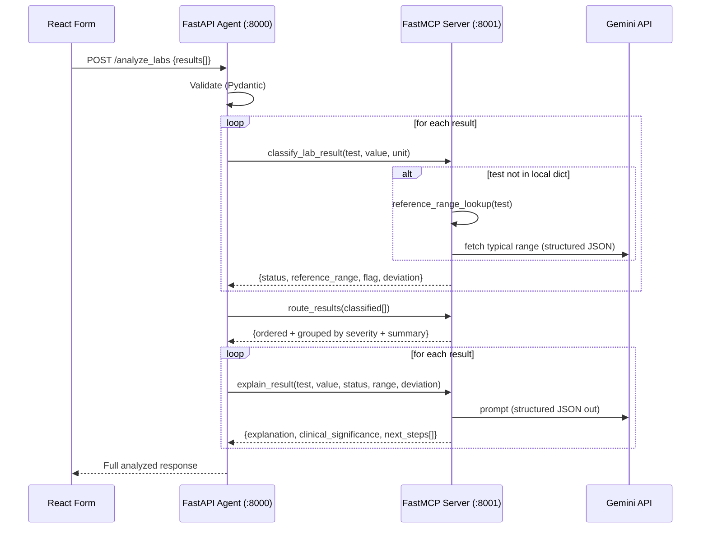

# Product Requirements Document (PRD)
## Clinical Lab Results Analyzer — Explainable AI Service

**Version:** 1.0
**Status:** Draft for approval
**Owner:** hp
**Last updated:** 2026-09-02

---

## 0. Document Purpose & Decisions Log

This PRD is written to be **implementation-ready with no hidden assumptions**. Every design choice that was not explicitly stated in the assignment is recorded below as an explicit, reversible decision. If you disagree with any item, say so and it will be changed before any code is written.

### 0.1 Confirmed requirements (from you)

| # | Decision | Choice |
|---|----------|--------|
| D1 | Architecture | **FastAPI gateway (the "agent") + a separate FastMCP server** hosting the tools. The FastAPI app is an MCP *client* and performs all tool communication over MCP, exactly as prescribed by the assignment. |
| D2 | LLM provider & model | **Google Gemini, free tier.** Model is configurable via `GEMINI_MODEL`; default targets a free-tier Flash model (see §7.1). |
| D3 | Frontend input | **Manual entry form only** (no CSV upload in the UI). |
| D4 | Frontend stack | **Vite + React + Tailwind CSS.** |

### 0.2 Decisions made on your behalf (tell me to change any)

| # | Decision | Rationale |
|---|----------|-----------|
| A1 | PRD delivered as `PRD.md` (Markdown) in the repo root. | Version-controlled, renders in GitHub, standard for engineering PRDs. |
| A2 | **3 core MCP tools** = `classify_lab_result`, `route_results`, `explain_result`. A 4th optional tool `reference_range_lookup` is included (the assignment lists it as optional) and is called internally by classify. | Matches your "3 tools" requirement while satisfying the assignment's optional tool. |
| A3 | Support **8 common lab tests** with documented adult reference ranges (§5). Extensible via one data file. | Assignment requires "at least 5". 8 gives good demo coverage. |
| A4 | **Classification is deterministic/local** (rule-based against reference ranges). The **LLM is used only for explanation & next steps**, and is instructed never to override the computed status. | Explainability + safety: the "why" is a transparent rule, not a black box. Also makes the app degrade gracefully if the LLM is unavailable. |
| A5 | The LLM explanation is generated for **every result** (per assignment FAQ), but the UI visually emphasizes abnormal ones. | FAQ: "Do I have to call the LLM for every result? Yes." |
| A6 | MCP transport = **Streamable HTTP**; MCP server on `:8001`, FastAPI on `:8000`, frontend dev server on `:5173`. | Two clean processes; HTTP transport makes the client/server split explicit. |
| A7 | Request cap: **max 25 results per request**. | Keeps well inside free-tier rate limits and bounds latency. |
| A8 | Graceful degradation: if Gemini fails after retries, the result is still returned with its deterministic classification and an `explanation_status: "unavailable"` flag. | Rubric requires "end-to-end works without crashes." |
| A9 | **3 synthetic CSVs** are still delivered in `/test_data` as required test fixtures, used for backend testing and as reference values to type into the form (not uploaded via UI, since input is form-only). | Assignment deliverable requires 3 CSVs. |
| A10 | Scope excludes auth, database/persistence, deployment, real EHR integration, and CSV upload. | 8-hour scope; see §11 Non-Goals. |

### 0.3 ⚠️ Clinical safety disclaimer (product-wide)

This application is a **technical demonstration**. Reference ranges are **illustrative adult values** and vary by laboratory, assay, age, sex, and clinical context. Outputs are **not medical advice** and must not be used for real clinical decisions. This disclaimer appears in the UI, the API responses, and the README.

---

## 1. Overview

### 1.1 Problem statement

Clinical laboratories produce hundreds of results daily. Providers need to quickly identify abnormal results, understand their clinical significance, and decide next steps. Existing "flagging" is often a bare "abnormal" with no explanation.

### 1.2 Product goal

A full-stack web service that accepts lab results, classifies each as **Normal / Warning / Critical**, routes them by severity, and produces an **explainable** result: the exact rule that fired, the reference range used, the magnitude of deviation, a plain-language clinical explanation (LLM-generated), and suggested next steps.

### 1.3 Guiding principle — Explainable AI

For every flagged result the user can see **what** (the status), **why** (the numeric rule and reference range that produced it), and **what it means / what to do** (the LLM explanation and next steps). The status is never a mystery number from a model — it is a transparent, inspectable rule. The LLM adds human-readable meaning on top of that transparent rule.

---

## 2. Users & Use Cases

| Persona | Need | How the product serves it |
|---------|------|---------------------------|
| Clinician / provider (primary) | Rapidly triage a panel of results | Severity-ordered display, critical first, with one-glance color coding |
| Lab technician | Sanity-check flagged values | Shows the exact reference range and rule applied |
| Developer / AI agent (secondary) | Reuse the classification service | Standardized MCP tools any MCP client can call |

**Primary use case:** A provider manually enters a set of lab results into the form, submits, and receives a color-coded, severity-ordered list with per-result explanations and next steps.

---

## 3. System Architecture

### 3.1 Components

```
┌─────────────────────────┐        HTTP/JSON         ┌──────────────────────────┐
│  Frontend (React/Vite)  │  ───────────────────────▶ │  FastAPI Gateway (Agent) │
│  - LabInput form        │   POST /analyze_labs      │  :8000                    │
│  - ResultsDisplay       │ ◀───────────────────────  │  - validates request      │
│  - SeverityBadge        │        JSON response      │  - orchestrates agent     │
│  :5173                  │                           │  - MCP CLIENT             │
└─────────────────────────┘                           └────────────┬─────────────┘
                                                                    │ MCP (Streamable HTTP)
                                                                    ▼
                                                       ┌──────────────────────────┐
                                                       │  FastMCP Server           │
                                                       │  :8001                    │
                                                       │  Tools:                   │
                                                       │   1 classify_lab_result   │
                                                       │   2 route_results         │
                                                       │   3 explain_result ───────┼──▶ Gemini API
                                                       │   4 reference_range_lookup┼──▶ Gemini API
                                                       └──────────────────────────┘
```

### 3.2 The agent flow: Classify → Route → Explain



**Why FastAPI is the "agent":** it owns the orchestration (the Classify → Route → Explain sequence, retries, and aggregation) and it is the sole MCP client. All tool calls go through MCP, satisfying the assignment requirement that "the MCP server is built and used for all communication by the agent."

### 3.3 Process/port map

| Process | Port | Command (indicative) |
|---------|------|----------------------|
| FastMCP server | 8001 | `python -m backend.mcp_server.server` |
| FastAPI gateway | 8000 | `uvicorn backend.api.main:app --port 8000` |
| Frontend dev server | 5173 | `npm run dev` |

A convenience script (`run_dev.sh` / documented in README) starts the MCP server and the API together.

---

## 4. MCP Tools — Contracts

All tools live on the FastMCP server. Inputs/outputs are JSON-serializable and validated with Pydantic models shared across the codebase. Every tool is independently unit-testable.

### 4.1 Tool 1 — `classify_lab_result`

Deterministic, no LLM.

**Input**

| Field | Type | Required | Notes |
|-------|------|----------|-------|
| `test_name` | string | yes | Case-insensitive; normalized (trim, title-case, alias map) |
| `value` | number | yes | Must be numeric; else validation error |
| `unit` | string | yes | Compared to expected unit; mismatch flagged |

**Output**

```json
{
  "test_name": "Hemoglobin",
  "value": 8.1,
  "unit": "g/dL",
  "status": "Warning",
  "flag": "low",
  "reference_range": { "low": 12.0, "high": 17.5, "unit": "g/dL" },
  "thresholds": { "critical_low": 7.0, "low": 12.0, "high": 17.5, "critical_high": 20.0 },
  "deviation": { "direction": "low", "distance_from_bound": 3.9, "percent_from_bound": 32.5 },
  "reference_source": "local_dict",
  "unit_mismatch": false,
  "rule_applied": "8.1 is below normal_low (12.0) but above critical_low (7.0) => Warning (low)"
}
```

`status` ∈ `Normal | Warning | Critical | Unknown`. `flag` ∈ `in_range | low | high | unknown`. `reference_source` ∈ `local_dict | llm_lookup | none`.

### 4.2 Tool 2 — `route_results`

Deterministic, no LLM.

**Input:** `results`: array of classify outputs.

**Output**

```json
{
  "summary": { "critical": 1, "warning": 1, "normal": 5, "unknown": 0, "total": 7 },
  "results_by_severity": {
    "critical": [ ... ],
    "warning":  [ ... ],
    "normal":   [ ... ],
    "unknown":  [ ... ]
  },
  "ordered_results": [ /* flat list: all critical, then warning, then normal, then unknown */ ]
}
```

Ordering rule: **Critical → Warning → Normal → Unknown**. Within a group, preserve input order (stable sort).

### 4.3 Tool 3 — `explain_result`

Uses Gemini. Called once per result.

**Input:** `test_name`, `value`, `unit`, `status`, `flag`, `reference_range`, `deviation`, optional `patient_context` (`age`, `sex`).

**Output**

```json
{
  "explanation": "A hemoglobin of 8.1 g/dL is below the normal range (12.0–17.5 g/dL), indicating anemia...",
  "clinical_significance": "Low hemoglobin reduces oxygen-carrying capacity...",
  "next_steps": ["Repeat CBC to confirm", "Schedule hematology consult", "Evaluate for source of blood loss"],
  "explanation_status": "ok",
  "model": "gemini-2.5-flash"
}
```

`explanation_status` ∈ `ok | unavailable`. On LLM failure after retries, returns a safe fallback message and `unavailable` (classification is still valid). The LLM is **instructed to ground every statement in the provided numbers and never contradict the given `status`** (see §7.2).

### 4.4 Tool 4 (optional) — `reference_range_lookup`

Fallback used by `classify_lab_result` when a test is absent from the local dictionary. Queries Gemini for a typical adult reference range returned as strict JSON (`low`, `high`, `unit`, `critical_low`, `critical_high`), validates it, and marks `reference_source = "llm_lookup"`. If it fails validation, the test is classified `Unknown`. LLM-derived ranges are always flagged as such so users know they were not from the curated table.

---

## 5. Reference Ranges & Classification Rules

### 5.1 Curated reference table (adult, illustrative)

Stored in `backend/mcp_server/data/reference_ranges.py`. A dash (—) means no critical bound on that side.

| Test | Unit | Normal Low | Normal High | Critical Low | Critical High |
|------|------|-----------:|------------:|-------------:|--------------:|
| Hemoglobin | g/dL | 12.0 | 17.5 | 7.0 | 20.0 |
| WBC (White Blood Cells) | 10³/µL | 4.0 | 11.0 | 2.0 | 30.0 |
| Platelets | 10³/µL | 150 | 450 | 50 | 1000 |
| Glucose (fasting) | mg/dL | 70 | 99 | 50 | 400 |
| Creatinine | mg/dL | 0.6 | 1.3 | — | 4.0 |
| Sodium | mmol/L | 135 | 145 | 120 | 160 |
| Potassium | mmol/L | 3.5 | 5.1 | 2.5 | 6.5 |
| Calcium | mg/dL | 8.6 | 10.2 | 6.0 | 13.0 |

Aliases (e.g., "Hgb" → "Hemoglobin", "WBC count" → "WBC", "K" → "Potassium", "Na" → "Sodium") are handled by a normalization map so common variants resolve to a canonical test.

### 5.2 Classification algorithm (exact, inclusive rules)

```
Given value v and bounds (crit_low, low, high, crit_high):

1. If crit_low is not None and v <= crit_low  -> Critical, flag=low
2. If crit_high is not None and v >= crit_high -> Critical, flag=high
3. If v < low   -> Warning, flag=low
4. If v > high  -> Warning, flag=high
5. Otherwise    -> Normal,  flag=in_range
```

Boundary behavior (documented, no ambiguity):
- A value exactly equal to `low` or `high` is **Normal** (bounds inclusive of normal).
- A value exactly equal to `critical_low`/`critical_high` is **Critical** (critical bounds inclusive).
- If the test is unknown and lookup fails: **Unknown** (never crashes the request).

### 5.3 Deviation metrics (for explainability)

For out-of-range values, the classifier computes:
- `distance_from_bound` = absolute distance from the nearest normal bound.
- `percent_from_bound` = distance as a percentage of that bound.

These numbers are shown in the UI and passed to the LLM so its explanation is grounded in the actual magnitude of abnormality.

---

## 6. API Specification (FastAPI Gateway)

### 6.1 `POST /analyze_labs`

**Request body**

```json
{
  "patient_context": { "age": 45, "sex": "female" },
  "results": [
    { "test_name": "Hemoglobin", "value": 8.1, "unit": "g/dL" },
    { "test_name": "Potassium", "value": 6.9, "unit": "mmol/L" },
    { "test_name": "Sodium", "value": 140, "unit": "mmol/L" }
  ]
}
```

`patient_context` is optional. `results` must contain 1–25 items.

**Response `200`**

```json
{
  "summary": { "critical": 1, "warning": 1, "normal": 1, "unknown": 0, "total": 3 },
  "results_by_severity": { "critical": [ ... ], "warning": [ ... ], "normal": [ ... ], "unknown": [ ] },
  "ordered_results": [ /* enriched result objects, critical first */ ],
  "generated_at": "2026-09-02T13:40:00Z",
  "model": "gemini-2.5-flash",
  "disclaimer": "Illustrative only — not medical advice."
}
```

Each enriched result object = classify output + explain output merged (status, reference_range, thresholds, deviation, rule_applied, explanation, clinical_significance, next_steps, explanation_status).

### 6.2 `GET /health`

Returns `{ "status": "ok", "mcp_server": "reachable" | "unreachable" }`. Used by the frontend to show a connection indicator and by smoke tests.

### 6.3 Error handling matrix

| Condition | HTTP | Behavior |
|-----------|------|----------|
| Missing `test_name`/`value`/`unit` | 422 | Pydantic error naming the offending row/field |
| Non-numeric `value` | 422 | Clear message |
| Empty `results` | 422 | "At least one result required" |
| > 25 results | 422 | "Maximum 25 results per request" |
| Unknown test + lookup fails | 200 | Result returned with `status: Unknown`; request does **not** fail |
| Unit mismatch | 200 | `unit_mismatch: true`; classified against expected unit, discrepancy surfaced in UI |
| Gemini timeout / rate limit | 200 | Retry w/ backoff (`LLM_MAX_RETRIES`); then `explanation_status: unavailable`, classification still returned |
| MCP server unreachable | 503 | `{ "detail": "Analysis service unavailable" }`; UI shows friendly banner |

---

## 7. LLM Integration (Gemini)

### 7.1 Model selection

- Configured via env var **`GEMINI_MODEL`**; the default targets a **free-tier Flash-class model** (e.g., `gemini-2.5-flash`).
- **⚠️ Verify at build time:** The exact free-tier model IDs and rate limits evolve. Confirm the current free-tier Flash model and limits on Google's official docs before finalizing `.env`. Because the model is env-driven, changing it is a one-line edit — **no code change**.
- Last-known free-tier posture (to be re-confirmed): a Flash model with roughly ~15 requests/min, ~1,500 requests/day, ~1M tokens/min. The §0.2/A7 cap of 25 results/request keeps a single analysis comfortably inside per-minute limits.

### 7.2 Prompt design for `explain_result`

- **Inputs injected:** test name, value, unit, computed status, flag, reference range, deviation metrics, optional age/sex.
- **Structured output:** request JSON via Gemini's structured-output / `response_mime_type=application/json` with a response schema for `{explanation, clinical_significance, next_steps[]}`.
- **Temperature:** low (≈0.2) for consistent, conservative phrasing.
- **System instructions (summary):**
  1. Ground every statement in the provided numbers and range.
  2. **Do not change or dispute the provided `status`** — explain it, don't reclassify.
  3. Use clear, clinically appropriate language a provider would accept.
  4. Keep `explanation` to 2–4 sentences; `next_steps` to 2–4 concrete, actionable items.
  5. Include an implicit reminder that this is decision-support, not a diagnosis.
- **Validation:** response is parsed and schema-validated; malformed output triggers one repair retry, then the safe fallback.

### 7.3 Reliability

Central `gemini_client.py` wrapper handles: API key loading, timeout (`LLM_TIMEOUT_SECONDS`), exponential-backoff retries (`LLM_MAX_RETRIES`), JSON parsing/repair, and structured logging. No secrets are logged.

---

## 8. Frontend Specification (Vite + React + Tailwind)

### 8.1 Components

| Component | Responsibility |
|-----------|----------------|
| `App.jsx` | State, calls the API, holds results, shows disclaimer + health indicator |
| `LabInput.jsx` | Manual-entry form: dynamic rows of {test_name, value, unit}; add/remove row; optional age/sex; client-side validation; submit |
| `ResultsDisplay.jsx` | Renders severity-grouped sections (Critical → Warning → Normal → Unknown) with summary counts |
| `ResultCard.jsx` | One result: value vs range, `SeverityBadge`, deviation, expandable explanation + next steps |
| `SeverityBadge.jsx` | Color-coded status: 🚨 Critical = red, ⚠️ Warning = yellow/amber, ✓ Normal = green, ？ Unknown = gray |
| `ExplanationPanel.jsx` | The Explainable-AI block: rule applied, range used, source (local vs LLM), and LLM explanation + next steps |
| `api/client.js` | `analyzeLabs()` fetch wrapper, error handling |

### 8.2 UX requirements

- **Color coding is mandatory** (rubric): red/amber/green with icon + text label (never color alone — accessibility).
- Critical results appear first and are visually loudest.
- Every abnormal card shows the "why": e.g., "8.1 g/dL is below normal (12.0–17.5); at/below the critical threshold of 7.0? No → Warning." Numbers are always visible next to the badge.
- LLM explanation is shown for every result; abnormal cards are expanded by default, normal cards collapsed.
- Form supports quick entry of the 8 known tests (dropdown/autocomplete with unit auto-fill) while still allowing free-text test names (which exercise the lookup/Unknown paths).
- Loading, empty, and error states are all designed (spinner during analysis, friendly 503 banner, inline 422 messages).
- Product-wide disclaimer visible near results.

### 8.3 Form field validation (client-side, mirrors server)

- `test_name` non-empty; `value` numeric; `unit` non-empty.
- 1–25 rows.
- Submit disabled until at least one valid row.

---

## 9. Project Structure & Modular Standards

### 9.1 Repository layout

```
Clinic_mcp_aragen/
├── README.md
├── PRD.md
├── .gitignore
├── .env.example
├── run_dev.sh                      # starts MCP server + API together
├── backend/
│   ├── requirements.txt
│   ├── .env.example
│   ├── mcp_server/
│   │   ├── __init__.py
│   │   ├── server.py               # FastMCP app + tool registration
│   │   ├── tools/
│   │   │   ├── classify.py
│   │   │   ├── route.py
│   │   │   ├── explain.py
│   │   │   └── reference.py         # reference_range_lookup (optional)
│   │   ├── core/
│   │   │   ├── classifier.py        # PURE logic (no I/O) — fully unit-tested
│   │   │   └── config.py            # env-driven settings
│   │   ├── data/
│   │   │   └── reference_ranges.py  # curated table + alias map
│   │   ├── services/
│   │   │   └── gemini_client.py     # LLM wrapper (retry, JSON repair)
│   │   └── models/
│   │       └── schemas.py           # shared Pydantic models
│   ├── api/
│   │   ├── __init__.py
│   │   ├── main.py                  # FastAPI app: /analyze_labs, /health, CORS
│   │   ├── agent.py                 # orchestrator (classify→route→explain)
│   │   └── mcp_client.py            # FastMCP Client connection
│   └── tests/
│       ├── test_classifier.py       # deterministic rules + boundaries
│       ├── test_route.py            # ordering + summary counts
│       └── test_api.py              # integration w/ mocked Gemini + MCP
├── frontend/
│   ├── package.json
│   ├── vite.config.js
│   ├── tailwind.config.js
│   ├── postcss.config.js
│   ├── index.html
│   └── src/
│       ├── main.jsx
│       ├── App.jsx
│       ├── index.css
│       ├── api/client.js
│       └── components/
│           ├── LabInput.jsx
│           ├── ResultsDisplay.jsx
│           ├── ResultCard.jsx
│           ├── SeverityBadge.jsx
│           └── ExplanationPanel.jsx
└── test_data/
    ├── normal_panel.csv
    ├── mixed_panel.csv
    └── critical_panel.csv
```

### 9.2 Modular coding standards

- **Separation of concerns:** pure logic (`core/classifier.py`) has zero I/O and is unit-tested in isolation; LLM and MCP I/O live behind thin service modules; transport (FastAPI, FastMCP) is a thin shell over the logic.
- **One tool per module**; each tool imports pure logic + services, not the reverse.
- **Typed everywhere:** Python type hints + Pydantic models shared between server and API; no untyped dicts crossing boundaries.
- **Config via env only** (`config.py` reads `.env`); no secrets or magic numbers in code — thresholds live in the data file, tunables in `.env`.
- **Frontend:** one component per file; presentational (`SeverityBadge`) separated from container (`App`); API access isolated in `api/client.js`.
- **Formatting/linting:** `black` + `ruff` (Python), ESLint + Prettier (JS). Documented in README.
- **Docstrings** on every public function/tool; small, single-purpose functions.

### 9.3 Testing

- Unit: classifier boundary cases (at bound, just inside, just outside, at/beyond critical, unknown test, unit mismatch); router ordering + counts.
- Integration: `POST /analyze_labs` with Gemini and MCP mocked, asserting shape, ordering, and graceful degradation when the LLM "fails."
- Manual: the 3 CSVs in `/test_data` used as canonical scenarios (all-normal, mixed, all-critical).

---

## 10. Configuration (`.env`)

```
# --- Gemini ---
GEMINI_API_KEY=your_key_here
GEMINI_MODEL=gemini-2.5-flash          # confirm current free-tier ID at build time
LLM_TIMEOUT_SECONDS=20
LLM_MAX_RETRIES=2

# --- MCP ---
MCP_SERVER_HOST=127.0.0.1
MCP_SERVER_PORT=8001
MCP_SERVER_URL=http://127.0.0.1:8001/mcp
MCP_TRANSPORT=streamable-http

# --- API ---
API_HOST=127.0.0.1
API_PORT=8000
MAX_RESULTS_PER_REQUEST=25
CORS_ORIGINS=http://localhost:5173
```

`.env` is git-ignored; `.env.example` (no real key) is committed.

---

## 11. Non-Goals (explicitly out of scope)

Authentication/authorization; database or persistence of results; deployment/hosting; real EHR/LIS integration; CSV upload in the UI (form only, per D3); pediatric/sex-specific range logic beyond passing context to the LLM; storage of any patient PII; production clinical use.

---

## 12. Milestones (maps to the assignment's ~8-hour plan)

| # | Milestone | Output |
|---|-----------|--------|
| 1 | Scaffolding | Repo layout, `.env.example`, FastAPI + FastMCP skeletons, React/Vite/Tailwind boot |
| 2 | Gemini connectivity | `gemini_client.py`; verified single structured call |
| 3 | Core agent logic | `classifier.py` + tools `classify`/`route`/`explain` + `/analyze_labs` orchestration over MCP |
| 4 | Frontend | Form + results + badges wired to the API |
| 5 | Hardening | Error handling, graceful LLM degradation, 3 CSV scenarios, unit/integration tests |
| 6 | Docs & demo | README, meaningful git history, end-to-end demo |

---

## 13. Acceptance Criteria (maps to evaluation rubric)

| Rubric criterion | Weight | Acceptance test |
|------------------|-------:|-----------------|
| Agent classification logic | 30% | All boundary cases in §5.2 pass; unknown test → `Unknown` without crashing; unit mismatch flagged |
| AI explanation quality | 25% | Every result has an LLM explanation grounded in its numbers; explanations never contradict status; next_steps are actionable |
| Frontend UI & integration | 20% | Form → API → display works; correct red/amber/green coding with icons; critical shown first |
| Full-stack completion | 15% | End-to-end run with each of the 3 CSV scenarios completes with no crash, including when the LLM is forced to fail |
| Code quality & docs | 10% | Modular layout per §9; README with setup/architecture/provider/testing; meaningful commit history |

**Definition of Done:** all three CSV scenarios produce correct classifications and severity ordering; explanations render for every result; the app returns a valid response even with the Gemini key removed (classification intact, `explanation_status: unavailable`); README lets a new user run everything locally in three commands.

---

## 14. Risks & Mitigations

| Risk | Mitigation |
|------|------------|
| Free-tier rate limits during testing | 25-result cap; low temperature; retries w/ backoff; classification independent of LLM |
| LLM hallucinated explanation / wrong range | Classification is deterministic and authoritative; LLM instructed not to reclassify; lookup-derived ranges flagged as `llm_lookup` |
| Model ID drift on Google's side | `GEMINI_MODEL` env var; documented verification step |
| Clinical misuse | Prominent disclaimer in UI, API, README; "illustrative" ranges |
| Unit ambiguity | Expected unit per test; mismatches flagged, not silently trusted |

---

## 15. Glossary

- **MCP (Model Context Protocol):** standardized protocol for exposing tools to AI agents/clients.
- **FastMCP:** Python framework for building MCP servers/clients.
- **Agent:** here, the FastAPI orchestrator that sequences the MCP tools (Classify → Route → Explain).
- **Critical value / panic value:** a result so abnormal it warrants immediate attention.
- **Warning:** outside the normal reference range but not at a critical threshold.

---

*End of PRD v1.0 — awaiting approval before implementation.*
