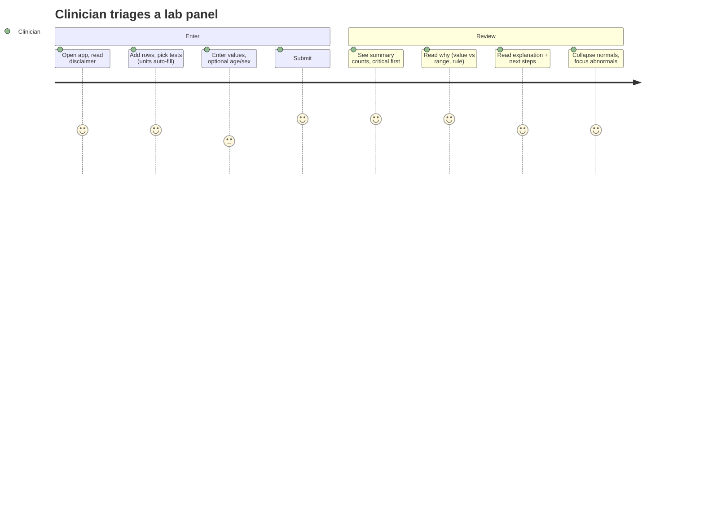
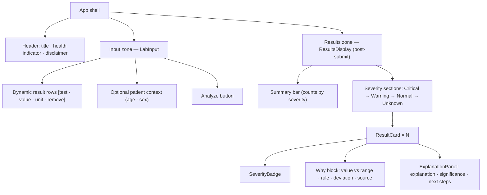
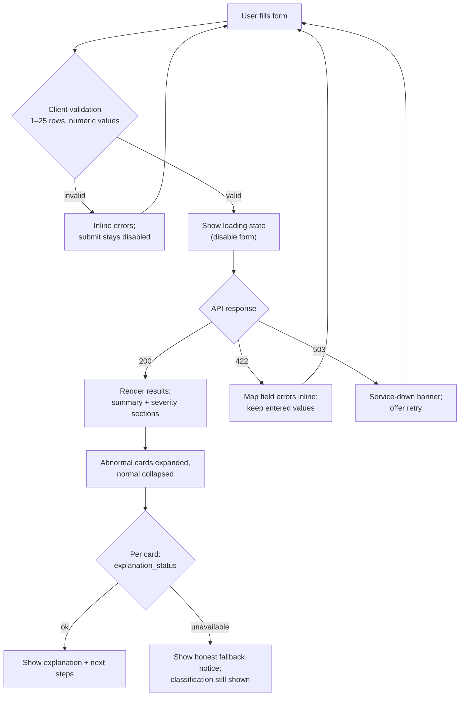

# UI / UX Specification — Clinical Lab Results Analyzer

**Version:** 1.0
**Status:** Draft (companion to [PRD.md](./PRD.md) v1.0 and [ARCHITECTURE.md](./ARCHITECTURE.md))
**Owner:** hp
**Last updated:** 2026-09-02
**Stack:** Vite + React + Tailwind CSS (PRD D4). Manual-entry form only (PRD D3).

> ⚠️ **Clinical safety note.** This is a technical demonstration. Reference ranges are illustrative adult values; outputs are **not medical advice**. The disclaimer is a first-class UI element (see §9).

---

## 1. Purpose & scope

This document specifies the interface and experience for the analyzer's web frontend: the design principles, screen structure, user flows, wireframes, component contracts, the visual design system, interaction and state behavior, accessibility, and content/microcopy.

It elaborates PRD §8 (Frontend Specification) and targets the rubric's *Frontend UI & integration* criterion (20%). It does not restate API contracts (see PRD §6 and ARCHITECTURE §9) except where they shape the UI.

The overriding UX job: make **Explainable AI** legible. For every result the user must be able to see, without effort, **what** it is (status), **why** (the numeric rule and reference range), and **what it means / what to do** (the LLM explanation and next steps).

---

## 2. Design principles

1. **Explainability is visible by default, not buried.** The "why" (value vs. range, the rule that fired, deviation) sits next to the status on every card. The narrative explanation is one glance away — and pre-expanded for anything abnormal.
2. **Severity drives the visual hierarchy.** Critical results are first, largest, and loudest; normal results recede. Ordering is always Critical → Warning → Normal → Unknown.
3. **Never rely on color alone.** Every status carries an icon *and* a text label *and* a color. This is an accessibility requirement, not a nicety (§10).
4. **Honest about uncertainty.** LLM-sourced ranges are labeled as such; unavailable explanations say so plainly rather than faking confidence; unknown tests are shown, not hidden.
5. **Safety is always on screen.** The clinical disclaimer is persistently visible near results; nothing in the UI implies diagnosis.
6. **Fast, forgiving input.** Known tests autocomplete and auto-fill units; validation is inline and immediate; the form never loses the user's work on an error.
7. **Every state is designed.** Loading, empty, inline validation (422), and service-down (503) are all first-class, not afterthoughts.

---

## 3. Users & primary journeys

Personas are inherited from PRD §2. The interface is built around the **clinician/provider** (primary), with affordances for the **lab technician** (wants to sanity-check the range/rule) — the developer/agent persona consumes MCP directly and needs no UI.

**Primary journey — triage a panel:**



---

## 4. Information architecture

Single-page application, single route. Two logical zones stacked vertically: an **input zone** (persistent) and a **results zone** (appears after the first successful analysis). A slim **app header** carries identity, the backend health indicator, and the disclaimer entry point.



---

## 5. User flows

### 5.1 Submit & render (happy path + branches)



### 5.2 Backend health indicator

On load and periodically, the app calls `GET /health`. `mcp_server: "reachable"` → green dot "Connected"; `"unreachable"` → amber dot "Analysis service starting…"; request failure → red dot "Backend offline." The indicator is informational; it never blocks the user from typing, but a 503 on submit surfaces the banner in §8.4.

---

## 6. Wireframes (text)

Low-fidelity, layout-only. Spacing, exact type sizes, and color come from the design system in §11. Icons shown as glyphs: 🚨 Critical · ⚠️ Warning · ✓ Normal · ❔ Unknown.

### 6.1 Initial screen — input zone

```
┌──────────────────────────────────────────────────────────────────────┐
│  🧪  Clinical Lab Results Analyzer          ● Connected   [ Disclaimer ]│
├──────────────────────────────────────────────────────────────────────┤
│                                                                        │
│   Enter lab results                                    1–25 results    │
│  ┌──────────────────────────────────────────────────────────────────┐ │
│  │  Test name            Value        Unit                           │ │
│  │  ┌──────────────────┐ ┌─────────┐ ┌──────────┐                    │ │
│  │  │ Hemoglobin      ▾│ │ 8.1     │ │ g/dL     │              [ ✕ ] │ │
│  │  └──────────────────┘ └─────────┘ └──────────┘                    │ │
│  │  ┌──────────────────┐ ┌─────────┐ ┌──────────┐                    │ │
│  │  │ Potassium       ▾│ │ 6.9     │ │ mmol/L   │              [ ✕ ] │ │
│  │  └──────────────────┘ └─────────┘ └──────────┘                    │ │
│  │                                                                    │ │
│  │  [ + Add result ]                                                  │ │
│  └──────────────────────────────────────────────────────────────────┘ │
│                                                                        │
│   Patient context (optional)                                           │
│   Age [ 45 ]     Sex ( ) Male  (•) Female  ( ) Unspecified             │
│                                                                        │
│                                        [   Analyze results  →   ]      │
│                                                                        │
│  ⚠ Illustrative demo — not medical advice.                             │
└──────────────────────────────────────────────────────────────────────┘
```

Test name is a combobox: typing filters the 8 known tests; choosing one auto-fills the expected unit; free text is allowed (exercises the lookup/Unknown path). The **Analyze** button is disabled until ≥1 valid row exists.

### 6.2 Loading state

```
┌──────────────────────────────────────────────────────────────────────┐
│  🧪  Clinical Lab Results Analyzer          ● Connected   [ Disclaimer ]│
├──────────────────────────────────────────────────────────────────────┤
│   [ form dimmed / inputs disabled ]                                    │
│                                                                        │
│                     ◐  Analyzing 2 results…                            │
│            Classifying → routing → generating explanations             │
└──────────────────────────────────────────────────────────────────────┘
```

### 6.3 Results screen — summary + severity sections

```
┌──────────────────────────────────────────────────────────────────────┐
│  Summary        🚨 1 Critical   ⚠ 1 Warning   ✓ 5 Normal   ❔ 0 Unknown │
│                                                    Analyzed 13:40 UTC   │
├──────────────────────────────────────────────────────────────────────┤
│  🚨 CRITICAL (1)                                                       │
│  ┌────────────────────────────────────────────────────────────────┐  │
│  │ 🚨 Potassium   6.9 mmol/L        [ CRITICAL · HIGH ]     (open)  │  │
│  │ Value 6.9  |  Normal 3.5–5.1  |  Critical ≥ 6.5                  │  │
│  │ ▬▬▬▬▬▬▬▬▬▬▬▬▬▬▬▬▬▬▬▬▬▬●  +35% above upper bound                  │  │
│  │ Rule: 6.9 ≥ critical_high (6.5) ⇒ Critical (high)               │  │
│  │ ── Explanation ─────────────────────────────────────────────    │  │
│  │ A potassium of 6.9 mmol/L is at/above the critical threshold…   │  │
│  │ Clinical significance: severe hyperkalemia can affect cardiac…  │  │
│  │ Next steps:                                                     │  │
│  │   • Confirm with repeat draw (rule out hemolysis)               │  │
│  │   • Obtain ECG                                                  │  │
│  │   • Escalate per critical-value protocol                        │  │
│  └────────────────────────────────────────────────────────────────┘  │
│                                                                        │
│  ⚠ WARNING (1)                                                         │
│  ┌────────────────────────────────────────────────────────────────┐  │
│  │ ⚠ Hemoglobin   8.1 g/dL          [ WARNING · LOW ]      (open)   │  │
│  │ Value 8.1  |  Normal 12.0–17.5  |  Critical ≤ 7.0               │  │
│  │ ●▬▬▬▬▬▬▬▬▬▬▬▬▬▬▬▬▬▬▬▬▬▬  −32.5% below lower bound                │  │
│  │ Rule: 8.1 < normal_low (12.0) but > critical_low (7.0) ⇒ Warning│  │
│  │ ── Explanation ─────────────────────────────────────────────    │  │
│  │ …grounded 2–4 sentence explanation + next steps…               │  │
│  └────────────────────────────────────────────────────────────────┘  │
│                                                                        │
│  ✓ NORMAL (5)                                                          │
│  ┌────────────────────────────────────────────────────────────────┐  │
│  │ ✓ Sodium   140 mmol/L            [ NORMAL ]           (collapsed)▸│  │
│  └────────────────────────────────────────────────────────────────┘  │
│  ┌────────────────────────────────────────────────────────────────┐  │
│  │ ✓ Glucose  88 mg/dL              [ NORMAL ]           (collapsed)▸│  │
│  └────────────────────────────────────────────────────────────────┘  │
│                                                                        │
│  ⚠ Illustrative demo — not medical advice.   [ ← Edit / re-analyze ]   │
└──────────────────────────────────────────────────────────────────────┘
```

Abnormal cards (Critical/Warning) render **expanded**; Normal/Unknown render **collapsed** to a single summary line and expand on click. The mini value-vs-range bar is a compact visualization of where the value sits relative to bounds.

### 6.4 Unknown test & LLM-unavailable variants

```
❔ UNKNOWN (1)
┌────────────────────────────────────────────────────────────────┐
│ ❔ Ferritin   28.9 ug/L            [ UNKNOWN ]         (open)     │
│ No curated range available and automated lookup did not return   │
│ a validated range. Status could not be determined.               │
└────────────────────────────────────────────────────────────────┘

⚠ WARNING (1)  — explanation unavailable
┌────────────────────────────────────────────────────────────────┐
│ ⚠ Hemoglobin   8.1 g/dL           [ WARNING · LOW ]   (open)     │
│ Value 8.1 | Normal 12.0–17.5 | Critical ≤ 7.0                    │
│ Rule: 8.1 < normal_low (12.0) ⇒ Warning (low)                   │
│ ── Explanation ─────────────────────────────────────────────    │
│ ⓘ AI explanation is temporarily unavailable. The classification │
│    above is complete and unaffected.                             │
└────────────────────────────────────────────────────────────────┘
```

When a range comes from the LLM fallback, the range line carries a small tag: `Normal 30–400 (source: AI lookup)`, so the provenance is never hidden.

### 6.5 Empty & error states

```
EMPTY (before first analysis, results zone absent)
   Results appear here after you analyze.

SERVICE DOWN (503 on submit)
┌────────────────────────────────────────────────────────────────┐
│ ⛔ Analysis service is unavailable right now.                    │
│    Your entries are saved below. [ Retry ]                       │
└────────────────────────────────────────────────────────────────┘

VALIDATION (422 / client) — inline, per field
   Value [  abc  ]  ⓧ Enter a number
   Test  [       ]  ⓧ Test name is required
```

---

## 7. Component breakdown

Mirrors PRD §8.1 with UX-level contracts. One component per file; presentational components (`SeverityBadge`) are separated from container logic (`App`); all network access is isolated in `api/client.js`.

| Component | Responsibility | Key props / state | UX notes |
|-----------|----------------|-------------------|----------|
| `App.jsx` | Owns app state; calls the API; holds results; renders header, disclaimer, health indicator | `results`, `loading`, `error`, `health` | Orchestrates the loading→results→error transitions; preserves form input across errors |
| `LabInput.jsx` | Manual-entry form: dynamic rows `{test_name, value, unit}`; add/remove; optional age/sex; client validation; submit | `rows[]`, `patientContext`, `onSubmit` | Combobox with unit auto-fill; disabled submit until valid; 1–25 rows enforced |
| `ResultsDisplay.jsx` | Renders the summary bar and severity-grouped sections in order | `summary`, `resultsBySeverity`, `ordered` | Section headers show counts; hides empty sections |
| `ResultCard.jsx` | One result: value vs range, badge, deviation bar, rule, expandable explanation | `result`, `defaultExpanded` | Expanded for abnormal, collapsed for normal; whole header row is the expand toggle |
| `SeverityBadge.jsx` | Color + icon + text label for a status | `status`, `flag` | Never color-only; includes flag (HIGH/LOW) when relevant |
| `ExplanationPanel.jsx` | The Explainable-AI block: rule applied, range + source, LLM explanation, significance, next steps | `result` | Honest `unavailable` notice when the LLM failed |
| `api/client.js` | `analyzeLabs()` + `getHealth()` fetch wrappers, error mapping | — | Translates 422/503 into typed UI errors |

---

## 8. States & feedback

**Loading.** Form disabled and dimmed; centered spinner with the phase caption ("Classifying → routing → generating explanations"). The button shows a spinner and the label changes to "Analyzing…".

**Empty.** Before the first analysis the results zone is absent; a one-line hint ("Results appear here after you analyze") sits where results will land. No fake skeletons.

**Success (200).** Summary bar first, then severity sections in fixed order; empty severity sections are omitted. Abnormal cards expanded, normal collapsed. A timestamp and the model name are shown subtly (from the response `generated_at` / `model`).

**Per-card LLM unavailable.** The classification block renders fully; the explanation area shows an informational notice (§6.4) rather than an error color — the result is valid, only the narrative is missing.

**Validation (422 / client-side).** Inline, field-level messages that mirror the server rules (test required, value numeric, unit required, 1–25 rows). Entered values are never cleared. Submit is disabled while any row is invalid.

**Service down (503).** A dismissible banner above the form with a Retry action; the form and its contents persist so the user loses nothing.

---

## 9. Explainability & safety UI patterns

**The three-part card.** Every result card is deliberately structured as *what → why → meaning*:

```
[ WHAT ]   Icon + status label + flag           →  SeverityBadge
[ WHY  ]   value vs normal/critical bounds,
           deviation (% and distance), and the
           exact rule_applied string             →  deterministic, always present
[ MEANING] LLM explanation + clinical
           significance + next_steps[]           →  ExplanationPanel (or honest fallback)
```

The **WHY** block is populated entirely from the deterministic classifier and is present even when the LLM is down — this is the guarantee that the status is never "a mystery number from a model."

**Disclaimer.** Persistent, visible near the results and reachable from the header. Copy: *"Illustrative demonstration — reference ranges are example adult values and this is not medical advice."* It is also present in every API response and the README (product-wide, PRD §0.3).

**Provenance.** Ranges from the curated table are shown plainly; ranges from the LLM fallback carry a `(source: AI lookup)` tag; `Unknown` results state that no validated range was available.

---

## 10. Accessibility

Target: **WCAG 2.1 AA**. The color-blind-safe, color-plus-label rule is mandatory (PRD §8.2).

- **Never color alone.** Status = icon (🚨/⚠/✓/❔) + text label ("CRITICAL") + color. A monochrome or color-blind view still communicates severity fully.
- **Contrast.** Body text and status labels use dark ink on light tinted backgrounds meeting ≥ 4.5:1; large headings and UI borders meet ≥ 3:1. Severity tints are chosen so their paired text token clears AA (see §11.1).
- **Keyboard.** Full tab order through rows → add/remove → context → submit → result cards. Card expand/collapse toggles are real buttons (Enter/Space). Visible focus rings on every interactive element.
- **Screen readers.** Severity conveyed via `aria-label` on the badge (e.g., "Critical, high"); the summary bar is an `aria-live="polite"` region so counts are announced after analysis; the 503 banner is `role="alert"`. Icons are `aria-hidden` with the label carrying the meaning.
- **Forms.** Every input has a `<label>`; inline errors are linked via `aria-describedby` and announced; the disabled submit communicates *why* through helper text, not by silence.
- **Motion.** The only motion is a spinner and expand/collapse; both respect `prefers-reduced-motion`.

---

## 11. Design system

Utility-first via Tailwind. Tokens below map to Tailwind scale values where relevant.

### 11.1 Severity palette (the core visual language)

| Status | Icon | Tint (bg) | Border/accent | Text (on tint) | Contrast |
|--------|:----:|-----------|---------------|----------------|----------|
| Critical | 🚨 | `#FEE2E2` (red-100) | `#DC2626` (red-600) | `#991B1B` (red-800) | AA ✅ |
| Warning | ⚠ | `#FEF3C7` (amber-100) | `#D97706` (amber-600) | `#92400E` (amber-800) | AA ✅ |
| Normal | ✓ | `#DCFCE7` (green-100) | `#16A34A` (green-600) | `#166534` (green-800) | AA ✅ |
| Unknown | ❔ | `#F3F4F6` (gray-100) | `#9CA3AF` (gray-400) | `#374151` (gray-700) | AA ✅ |

Each severity uses the tint as card/section background, the accent for the left border and badge, and the dark text token for labels — a consistent, learnable mapping.

### 11.2 Neutral & accent palette

| Role | Token |
|------|-------|
| Primary text | `#0F172A` (slate-900) |
| Secondary text | `#475569` (slate-600) |
| Hairline / border | `#E2E8F0` (slate-200) |
| App background | `#F8FAFC` (slate-50) |
| Surface / card | `#FFFFFF` |
| Primary action | `#2563EB` (blue-600), hover `#1D4ED8` (blue-700) |
| Focus ring | `#3B82F6` (blue-500), 2px offset |

### 11.3 Typography

System UI / Inter stack. Scale: page title 24px/600; section header 18px/600; card title (test name) 16px/600; body/explanation 14px/400; helper & metadata 12px/400. Line height 1.5 for body. Numeric values use tabular figures so columns of values align.

### 11.4 Spacing, radius, elevation

4px base scale (4 / 8 / 12 / 16 / 24 / 32). Card padding 16px; gap between cards 12px; section spacing 24px. Radius: inputs/cards 8px, badges 9999px (pill). Elevation kept flat — a 1px hairline border plus a subtle shadow on cards only; the color-coded left accent border (4px) does the heavy lifting for severity, not drop shadows.

### 11.5 Iconography

One icon per status, used everywhere that status appears (badge, section header, summary bar) for a consistent mental model: 🚨 Critical, ⚠ Warning, ✓ Normal, ❔ Unknown. Icons are decorative (`aria-hidden`); the adjacent text label is the accessible source of truth.

---

## 12. Responsive behavior

Desktop-first (the primary context is a workstation), but fluid down to tablet/mobile.

- **≥ 1024px:** input rows are a 3-column grid (test / value / unit) with the remove control inline; results are a single readable column (max width ~880px, centered).
- **640–1023px:** same layout, reduced horizontal padding; summary counts wrap to two lines if needed.
- **< 640px:** each input row stacks vertically (test, then value + unit side by side, then remove); the summary bar becomes a 2×2 grid of counts; cards go edge-to-edge with 12px gutters. Tap targets ≥ 44px.

---

## 13. Microcopy

| Context | Copy |
|---------|------|
| Page title | Clinical Lab Results Analyzer |
| Primary button (idle) | Analyze results |
| Primary button (busy) | Analyzing… |
| Add row | + Add result |
| Disabled-submit helper | Add at least one result with a test, numeric value, and unit. |
| Loading caption | Classifying → routing → generating explanations |
| Empty results | Results appear here after you analyze. |
| 503 banner | Analysis service is unavailable right now. Your entries are saved. |
| LLM unavailable (card) | AI explanation is temporarily unavailable. The classification above is complete and unaffected. |
| Unknown result | No validated reference range was available, so this result could not be classified. |
| Disclaimer | Illustrative demonstration — example adult ranges, not medical advice. |

Tone: clear, clinical, non-alarmist. Numbers and ranges are always shown alongside words. Errors say what to do next, never just what went wrong.

---

## 14. Traceability

| PRD / rubric anchor | Where addressed |
|---------------------|-----------------|
| PRD §8.1 components | §7 component breakdown |
| PRD §8.2 UX requirements (color+icon, critical-first, per-result explanation, states) | §2, §6, §8, §9, §11 |
| PRD §8.3 form validation | §5.1, §8 (validation), §13 |
| PRD §2 personas & primary use case | §3 users & journeys |
| PRD §6 API (health, errors) | §5.2, §8.4 |
| PRD §0.3 disclaimer | §9 safety patterns |
| Rubric: Frontend UI & integration (20%) | entire document; esp. §6, §9, §10 |

Technical structure behind this UI is in [ARCHITECTURE.md](./ARCHITECTURE.md); product requirements are in [PRD.md](./PRD.md).

---

*Companion documents: [PRD.md](./PRD.md) (requirements) · [ARCHITECTURE.md](./ARCHITECTURE.md) (technical structure).*
